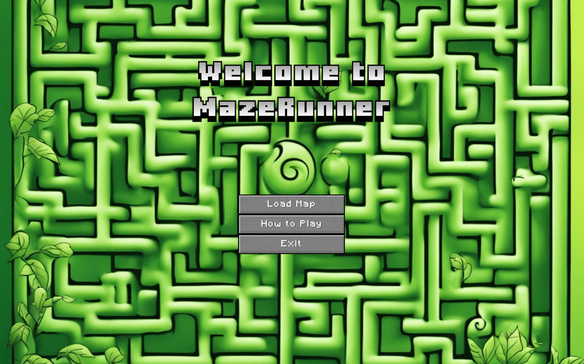

# Maze Runner Game

## Welcome Page

## How to Play

## Choose Map

## First Map

## Game Video on YouTube

## Game Video
<video src="assets/video1878273040.mp4" controls width="480"></video>

## Contributors
- Deniz Esma Nur
- Burak Ince

Welcome to the Maze Runner Game! This Java project utilizes the LibGDX library to create an interactive maze exploration game.

In this project, we will delve into the intricate world of Java programming to create an engaging maze exploration game. Our goal is to develop a fully functional game that challenges players to navigate through complex mazes, overcome obstacles, and achieve victory.

Throughout this term project, we will explore various aspects of Java programming, including class organization, folder structures, code units, and game logic. By reviewing the code structure of the Maze Runner Game, we gained insight into object-oriented programming principles and learned how to design and implement efficient and scalable Java applications.

Our journey took us through the labyrinthine corridors of game development, where we encountered classes representing game entities such as players, enemies, traps, tiles and maze components. We will organize these classes into logical folders and units, ensuring clarity and maintainability within our codebase.

Furthermore, we delved into the chaos of game logic, where we implemented algorithms for player movement, collision detection, enemy behavior, item collection, game over and victory conditions. By understanding and refining the game logic, we created an immersive gaming experience that captivates players and keeps them coming back for more. So, let's dive into this cool Maze Runner Game together!

## Features
- [x] Maze generation from a properties file and play it.
- [x] Movable Player(character) with the arrow keys in four directions.
- [x] Character has a limited number of lives.
- [x] Collect a key from the maze and reach the exit before losing all lives.
- [x] Static traps and the player loses one life on each contact.
- [x] Randomized creature movements
- [x] Scroll Mechanism: If the character walks towards the edge of the window, the displayed segment of the maze must change so that the character is in the center of the screen again.
- [x] HUD: Display the amount of lives left and key collection status at all times.
- [x] Game Menu: Available on startup and through the Esc button; must allow you to continue playing, choosing a new map, or exiting.
- [x] Victory and Game over: Your game must display that the player has won or lost, stop the gameplay and allow them to return to the main menu afterward.
- [x] Render the game using libGDX as a 2D game with a top-down view using simple 2D assets.
- [x] Support different screen sizes.
- [x] Play background music during gameplay and in the menu
- [x] Use sound effects when something happens in the game
- [x] Use object-orientation to implement your game.
- [x] Document your code and project.

## Bonus features
- [x] Mute/unmute Music (M-key)
- [x] Show bounding boxes debug (B-key)
- [x] Attack to enemies (A-Key)
- [x] Dash feature (Space-Key)
- [x] Light mode - Darkness / unexplored areas (L-Key)
- [x] Semi Smart Enemies(Chasing the player)
- [x] Collectible Light
- [x] Collectible heart
- [x] Stretching animation - idle time
- [x] Blood animation
- [x] Different kind of traps (Random fire and TriggerSpikes)
- [x] Different kind of traps (TimedSpikes and TriggerSpikes for each level)

## How To Play

### Objective
Your primary objective is to collect the key and reach the exit to advance to the next level. Be strategic, avoid enemies, and navigate through the maze to succeed.

### Controls
- `Movement`: Use the arrow keys (UP, DOWN, LEFT, RIGHT) to navigate through the maze.
- `Dash Attack`: Press the SPACE key to perform a dash move. Use this ability wisely to cover longer distances quickly and defend yourself against ghost enemies.
- `Attack`: Press the A key to attack. Defend yourself against ghost enemies and clear your path.
- `Audio Control`: Press M to mute background music. You can see the display on The Heads-Up Display (HUD).

### GamePlay Tips
- `Avoid Ghost Enemies`: Ghost enemies roam the maze. Avoid contact with them to prevent losing health. They can be smart and find you unexpected times.
- `Watch Out for Fire and Spike Traps`: Traps are dangerous obstacles. Stay alert and navigate carefully to avoid getting caught.
- `Collect the Key`: Locate and collect the key to unlock the exit door. The key is essential for progressing to the next level. Check the Heads-Up Display (HUD) to see if you've successfully collected the key.
- `Use Dash Strategically`: The dash ability can help you cover more ground quickly. Use it strategically to escape danger or reach distant areas.
- `Attack Wisely`: If surrounded by enemies, use the attack ability to clear a path. Be mindful of your health, and use attacks strategically.
- `Hope in Dark`: You can see only ahead of you in the maze. Find Light Bulb to turn-on the lights. This can be crucial for navigating through challenging sections of the maze.
- `Check HUD for Information`: The Heads-Up Display (HUD) provides information about your health, collected items. Pay attention to these indicators.

## Classes
### GameScreen.java

The GameScreen class is responsible for rendering the gameplay screen, handling game logic, and rendering game elements. Below is an overview of the classes and functionalities in the project.

The GameScreen class is the main class responsible for rendering the gameplay screen. It handles user input, updates game objects, and renders the maze, characters, and HUD.

####  Fields:
- `game`: Instance of the MazeRunnerGame class, used for accessing global resources and methods.
- `kameraX, kameraY`: Floating-point values representing the camera position in the game world.
- `gameViewport`: ScreenViewport for the game view.
- `hudViewport`: ScreenViewport for the HUD.
- `directionKeyPressed`: A LinkedHashSet to track pressed direction keys (UP, DOWN, LEFT, RIGHT).
- `sinusInput`: Floating-point value used for sinusoidal animation.
- `showBoundingBoxes`: Boolean flag indicating whether to display bounding boxes.
- `mazeMap`: Instance of the MazeMap class, representing the game map.
- `lighting`: Boolean flag indicating whether lighting effects are enabled.

####  Features:
- `Camera Setup`: Configures the camera for the game view, adjusting it based on the player's position and the size of the maze.
- `Viewport Handling`: Utilizes LibGDX viewports for managing the game and HUD viewport.
- `Input Handling`: Monitors user input for movement, attacks, dashing, and other game actions.
- `Object Rendering`: Renders tiles, static objects, characters, and the player character on the screen.
- `Collision Detection`: Detects collisions between the player and game objects, triggering appropriate actions.
- `HUD (Heads-Up Display)`: Displays player health, hearts animation, sound-mute functionality, and a key indicator on the HUD.
- `Camera Adjustment`: Dynamically adjusts the camera position to keep the player centered on the screen.
- `Debugging Features`: Supports the display of bounding boxes for tiles, static objects, and characters for debugging purposes.

####  Methods:
- `render(float delta)`: Updates game objects based on elapsed time. Handles collisions between the player and game objects. Processes user input. Renders the game elements in the correct order: tiles, static objects, characters, and HUD.
- `updateObjects(float delta)`: Updates all game objects based on the elapsed time.
- `destroyObjects()`: Removes objects from the mazeMap that have been destroyed.
- `handleInput(float delta)`: Handles user input for various actions such as pausing, dashing, attacking, toggling lighting, and displaying bounding boxes. Manages the movement of the player character.
- `adjustCamera()`: Continuously adjusts the camera position with respect to the player's position and screen size.
- `resize(int width, int height)`: Adjusts the viewports and camera position when the window is resized.
- `pause(), resume(), show(), hide()`: Methods from the Screen interface, not currently utilized.
- `dispose()`: Method from the Screen interface, not implemented.
- `drawHUD(float health)`: Draws the Heads-Up Display (HUD), including health hearts, key indicator, audio mute indicator, and lighting indicator.
- `debugBoundingBoxes()`: Draws bounding boxes for tiles, static objects, and characters for debugging purposes.

#### Controls:
- **Arrow keys:** Move the player character.
- **Space key:** Perform a dash action.
- **A key:** Initiate an attack.
- **H key:** Restore player health.(not in use // commented)
- **L key:** Toggle lighting on/off.
- **B key:** Toggle display of bounding boxes for debugging.
- **V key:** Go to Victory Screen (for testing purposes //commented).
- **G key:** Go to Game Over Screen (for testing purposes //commented).
- **Escape key:** Pause the game and go to the menu.

### LoadMapMenuScreen.java

The LoadMapMenuScreen class is responsible for displaying a menu screen that allows users to load different maps and levels within the game. It implements the LibGDX Screen class and sets up UI components for the menu, enabling users to choose between predefined levels, load a custom map or return to the main menu.

####  Features:
- `Stage and UI Elements`: Utilizes LibGDX's Stage and UI elements to create a graphical user interface for the load map menu.Sets up a background image and UI components such as labels and buttons.
- `Button Functionality`: Creates buttons for loading specific levels (1 to 5) loading a custom map, and returning to the main menu.Defines button actions using ChangeListeners to trigger the appropriate game methods.
- `Background Image`: Loads a background image to enhance the visual appeal of the menu screen.
- `Camera and Viewport Setup`: Configures an OrthographicCamera and ScreenViewport for rendering the menu screen.

#### Methods:
- `render(float delta)`: Renders the load map menu screen. Clears the screen and updates/draws the stage.
- `handleInput(float delta)`: Delegates input handling to the game's input handling method.
- `resize(int width, int height)`: Adjusts the stage viewport when the screen is resized. Updates the background image size accordingly.
- `dispose()`: Disposes of resources, particularly the stage, when the screen is disposed.
- `show()`: Sets the input processor to allow the stage to receive input events when the screen becomes the current screen.

#### Button Actions:
- `LoadLevel1 to LoadLevel5`: ChangeListener methods associated with level buttons trigger the game.loadLevel() method with the respective level number.
- `LoadMapButton`: ChangeListener method triggers the game.loadCustomMap() method.
- `BacktoMainMenu`: ChangeListener method triggers the game.goToMenu() method, returning to the main menu.

### MenuScreen.java

The MenuScreen class is responsible for displaying the main menu of the game. It extends the LibGDX Screen class and sets up UI components for the menu. Users can navigate to the game screen, load a custom map, or exit the game through this menu.

####  Features:
- `Stage and UI Elements`: Utilizes LibGDX's Stage and UI elements to create a graphical user interface for the main menu. Sets up a background image and UI components such as labels and buttons.
- `Button Functionality`: Creates buttons for loading maps, entering the game, and exiting the application. Defines button actions using ChangeListeners to trigger the appropriate game methods.
- `Background Image`: Loads a background image to enhance the visual appeal of the menu screen.
- `Camera and Viewport Setup`: Configures an OrthographicCamera and ScreenViewport for rendering the menu screen.
- `Conditional Button`: If a map is loaded and the game is ongoing, adds a button to go directly to the game.

#### Methods:
- `render(float delta)`: Renders the menu screen. Clears the screen and updates/draws the stage.
- `handleInput(float delta)`: Delegates input handling to the game's input handling method.
- `resize(int width, int height)`: Adjusts the stage viewport when the screen is resized. Updates the background image size accordingly.
- `dispose()`: Disposes of resources, particularly the stage, when the screen is disposed.
- `show()`: Sets the input processor to allow the stage to receive input events when the screen becomes the current screen.

#### Button Actions:
- `GoToGameButton`: If a map is loaded and the game is ongoing, a button is added to go directly to the game. ChangeListener method triggers the game.goToGame() method.
- `LoadMapButton`: ChangeListener method triggers the `game.goToLoadMap()` method.
- `HowToPlayButton`: ChangeListener method triggers the `game.goToHowToPlay()` method.
- `ExitButton`: ChangeListener method triggers the `Gdx.app.exit()` method to exit the application.

### GameOverScreen.java

The GameOverScreen class represents the screen displayed when the game concludes, offering options to the player to return to the main menu. It utilizes the LibGDX framework for UI rendering and input handling.

####  Fields:
- `game`: Represents the MazeRunnerGame instance, allowing access to global resources and methods.
- `stage`: A stage containing UI elements for the game over screen.
- `backgroundImage`: An image element representing the background of the game over screen.

#### Methods:
- `render(float delta)`: Renders the game over screen, clearing the screen, updating the stage, and drawing UI elements. It also calls handleInput(delta) to manage input.
- `handleInput(float delta)`: Delegates input handling to the MazeRunnerGame class, allowing for potential post-game actions.
- `resize(int width, int height)`: Adjusts the stage viewport when the screen is resized, ensuring proper rendering.
- `dispose()`: Disposes of resources associated with the stage when the screen is no longer in use.
- `show()`: Sets the input processor to the stage, enabling it to receive input events.
- `pause(), resume(), hide()`: Methods from the Screen interface left unused in this screen.

#### UI Elements:
- `Background Image`: Represents the visual backdrop of the game over screen.
- `Table Layout`: Utilizes a table for layout management, ensuring flexibility and ease of arrangement for UI elements.
- `Title Label`: Displays "GAME OVER!" using a styled label as the title of the screen.
- `Button to Main Menu`: Presents a clickable button ("Go To Main Menu") that, when pressed, triggers the goToMenu() method in the MazeRunnerGame class to return to the main menu.
- `Button Listener`: Implements a listener for the "Go To Main Menu" button, specifying the action to be taken when the button is pressed.

#### Features:
- `Construction`: Create an instance of GameOverScreen by providing the MazeRunnerGame instance.
- `Rendering`: Call the render(float delta) method in the game loop to render the game over screen.
- `Input Handling`: Use the handleInput(float delta) method to manage player input during the game over screen.
- `Resizing`: Call the resize(int width, int height) method when the screen size changes to ensure proper layout.
- `Disposal`: Invoke the dispose() method when the screen is no longer needed to release associated resources.
- `Showing the Screen`: Call the show() method to set the input processor and make the screen active.

### VictoryScreen.java

The VictoryScreen class represents the screen displayed when the player successfully completes a level, providing options to return to the main menu or proceed to the next level. This class is integrated into the Maze Runner game using the LibGDX framework for UI rendering and input handling.

####  Fields:
- `game`: Represents the MazeRunnerGame instance, allowing access to global resources and methods.
- `stage`: A stage containing UI elements for the victory screen.
- `backgroundImage`: An image element representing the background of the victory screen.
- `nextNumber`: An integer representing the next level to be played.

#### Methods:
- `render(float delta)`: Renders the victory screen, clearing the screen, updating the stage, and drawing UI elements. It also calls handleInput(delta) to manage input.
- `handleInput(float delta)`: Delegates input handling to the MazeRunnerGame class, allowing for potential post-victory actions.
- `resize(int width, int height)`: Adjusts the stage viewport when the screen is resized, ensuring proper rendering.
- `dispose()`: Disposes of resources associated with the stage when the screen is no longer in use.
- `show()`: Sets the input processor to the stage, enabling it to receive input events.
- `pause(), resume(), hide()`: Methods from the Screen interface left unused in this screen.

#### UI Elements:
- `Background Image`: Represents the visual backdrop of the victory screen.
- `Table Layout`: Utilizes a table for layout management, ensuring flexibility and ease of arrangement for UI elements.
- `Title Label`: Displays "VICTORY" using a styled label as the title of the screen.
- `Buttons`: Go To Main Menu: A clickable button to return to the main menu when pressed.
- `Next Level`: Appears if there is an available next level; a button to proceed to the next level when pressed.
- `Button Listeners`: Implements listeners for both buttons, specifying actions to be taken when each button is pressed.

#### Features:
- `Construction`: Create an instance of VictoryScreen by providing the MazeRunnerGame instance.
- `Rendering`: Call the render(float delta) method in the game loop to render the victory screen.
- `Input Handling`: Use the handleInput(float delta) method to manage player input during the victory screen.
- `Resizing`: Call the resize(int width, int height) method when the screen size changes to ensure proper layout.
- `Disposal`: Invoke the dispose() method when the screen is no longer needed to release associated resources.
- `Showing the Screen`: Call the show() method to set the input processor and make the screen active.

### HowToPlay.java

The HowToPlay class represents the screen displayed when the player wants to see instructions and how to play the game. This class is integrated into the Maze Runner game using the LibGDX framework for UI rendering and input handling.

####  Fields:
- `game`: Represents the MazeRunnerGame instance, allowing access to global resources and methods.
- `stage`: A stage containing UI elements for the HowToPlay screen.
- `backgroundImage`: An image element representing the background of the HowToPlay screen.

#### Methods:
- `render(float delta)`: Renders the HowToPlay screen, clearing the screen, updating the stage, and drawing UI elements. It also calls handleInput(delta) to manage input.
- `handleInput(float delta)`: Delegates input handling to the MazeRunnerGame class, allowing for pressing the ESC button and returning to the Menu Screen.
- `resize(int width, int height)`: Adjusts the stage viewport when the screen is resized, ensuring proper rendering.
- `dispose()`: Disposes of resources associated with the stage when the screen is no longer in use.
- `show()`: Sets the input processor to the stage, enabling it to receive input events.
- `pause(), resume(), hide()`: Methods from the Screen interface left unused in this screen.

#### UI Elements:
- Background Image: Represents the visual backdrop of the HowToPlay screen.

#### Features:
- `Construction`: Create an instance of the HowToPlay screen by providing the MazeRunnerGame instance.
- `Rendering`: Call the render(float delta) method in the game loop to render the HowToPlay screen.
- `Input Handling`: Use the handleInput(float delta) method to manage player input during the HowToPlay screen.
- `Resizing`: Call the resize(int width, int height) method when the screen size changes to ensure proper layout.
- `Disposal`: Invoke the dispose() method when the screen is no longer needed to release associated resources.
- `Showing the Screen`: Call the show() method to set the input processor and make the screen active.

### MazeRunnerGame.java

The MazeRunnerGame class serves as the core of the Maze Runner game, extending the LibGDX Game class. It manages screens, global resources like SpriteBatch and Skin, and handles the creation, updating, and disposal of game screens and resources.

####  Fields:
- `currentScreen`: Represents the current active screen.
- `uiDefaultWidth` and `uiDefaultHeight`: Default dimensions used for UI scaling.
- `mazeMap`: Represents the current maze map being played.
- `spriteBatch`: Used for rendering graphics.
- `skin`: UI skin for styling elements.
- `gameState`: Enum indicating the current game state (e.g., MENU, RUNNING, VICTORY).
- `heartsAnimation`: Animation representing hearts for lives.
- `HUD`: TextureRegion for the Heads-Up Display (HUD).
- `fileChooser`: NativeFileChooser for file-related operations.
- `backgroundMusic`: Music object for background music.
- `backgroundMusicVolume` and `mazeMapMusicVolume`: Volume levels for background music.
- `backgroundMusicMuted`: Indicates whether background music is muted.
- `currentLevel`: Represents the current level being played.
- `levelPlayed`: Array indicating which levels have been played.

#### Methods:
- `handleInput(float delta)`: Listens for global input (e.g., mute music).
- `loadLevel(int level)`: Loads a specific level based on provided map file content.
- `startBackgroundMusic()`: Switches and starts background music based on game state and level.
- `stopBackgroundMusic()`: Stops the currently playing background music.
- `muteBackgroundMusic()`: Mute or unmute the background music based on its current state.
- `loadCustomMap()`: Opens a file chooser for loading a custom map.
- `createMazeMap(String[] lines, int level)`: Parses map file content and creates a MazeMap object.
- `goToLoadMap(), goToVictoryScreen(), goToHowToPlay(), goToGameOverScreen(), goToMenu(), goToGame()`: Switch screens based on game state.
- `loadLivesAnimation()`: Loads the animation for heart/lives.
- `dispose()`: Cleans up resources when the game is disposed of.

#### Features:
- `Construction`: Construct an instance of MazeRunnerGame with an appropriate NativeFileChooser for file-related operations.
- `Level Loading`: Use loadLevel(int level) to load specific levels based on map file content.
- `Screen Navigation`: Utilize methods like goToLoadMap(), goToVictoryScreen(), etc., to switch between different game screens.
- `Background Music`: Control background music using methods like startBackgroundMusic(), stopBackgroundMusic(), and muteBackgroundMusic().
- `Resource Retrieval`: Use getter methods to retrieve specific resources (e.g., skin, sprite batch, animation).
- `Game State Handling`: Check and set the game state using getGameState() and setGameState().

### MazeMap.java
The MazeMap class represents the maze map in the Maze Runner game. It includes tiles, static objects, dynamic objects, and the player character. The class manages collisions, game object creation, and provides methods to interact with the game world.

####  Fields:
- `height and width`: Dimensions of the maze map.
- `tiles`: 2D array representing tiles in the maze.
- `staticObjects`: Mapping of static objects like traps, keys, etc., with their positions.
- `dynamicObjects`: List of dynamic objects like enemies.
- `player`: Player character in the maze.
- `world`: Box2D physics world for collision detection.
- `WALL_FILTER`: Constant representing the group index for wall collision filtering.

#### Methods:
- `characterAttemptMoveTo(Character character, float x, float y)`: Attempts a move for a given character to specified coordinates, considering collisions with tiles, static objects, and dynamic objects.
- `getCollisions(Rectangle boundingBox, GameObject self)`: Returns a list of collisions with a given bounding box, ignoring a specified game object.
- `getPlayer()`: Retrieves the player character.
- `getHeight()` and `getWidth()`: Get the height and width of the maze.
- `getTile(int x, int y)`: Retrieves the tile at the specified coordinates.
- `getStaticObject(float x, float y)`: Retrieves the static object at the specified coordinates.
- `getStaticObjects()`: Retrieves the mapping of all static objects.
- `getDynamicObjects()`: Retrieves the list of dynamic objects.
- `getWorld()`: Retrieves the Box2D physics world.

#### Features:
- `Construction`: Instantiate MazeMap with dimensions and a map of game objects.
- `Collision Handling`: Use `characterAttemptMoveTo()` to check if a character can move to specified coordinates.
- Use `getCollisions()` to get collisions with a bounding box, ignoring a specific game object.
- `Retrieving Game Objects`: Use methods like getPlayer(), getTile(), and getStaticObject() to retrieve specific game objects.
- `Accessing Map Information`: Use getHeight() and getWidth() to get the dimensions of the maze. Access the map's static and dynamic objects using getStaticObjects() and getDynamicObjects().
- `Physics World`: Retrieve the Box2D physics world using getWorld().

### Position.java

The Position class represents a 2D position in space with x and y coordinates. It provides methods for creating, setting, and comparing positions, as well as overriding the equals, hashCode, and toString methods for proper object comparison and string representation.

####  Fields:
- `x` and `y`: Represent the x and y coordinates of the position.
- **Constructors** `Position(float x, float y)`: Constructs a Position object with the specified x and y coordinates.
- `Position(Position otherPosition)`: Constructs a Position object using the coordinates of another Position object.

#### Methods:
- `setPosition(Position position)`: Sets the coordinates of the position based on another Position object.
- `equals(Object o)`: Checks if this Position is equal to another object based on their x and y coordinates.
- `hashCode()`: Generates a hash code for this Position based on its x and y coordinates.
- `toString()`: Provides a string representation of the Position object.

#### Features:
- `Construction`: Create a Position instance by providing x and y coordinates.
- `Setting Position`: Use the `setPosition(Position position)` method to set the coordinates of the position based on another Position object.
- `Comparison`: Utilize the equals(Object o) method to check if two Position objects are equal. The hashCode() method can be used to generate a hash code for the Position object.
- `String Representation`: Obtain a string representation of the Position object using the toString() method.

### GameObject.java

The GameObject class serves as a generic object in the game world, providing a common base for various game entities. Subclasses are expected to extend this class, providing specific behavior and additional properties. This abstract class defines attributes such as position, bounding box, texture, and health, along with methods for updating, collision handling, and destruction.

####  Fields:
- `id`: A unique identifier for each GameObject.
- `mazeMap`: Reference to the MazeMap this game object belongs to.
- `width` and `height`: Dimensions of the game object.
- `position`: Current position of the game object.
- `boundingBox`: Rectangle representing the bounding box of the game object.
- `walkable`: Defines whether this game object can be walked on.
- `texture`: TextureRegion representing the appearance of the game object.
- `destroyed`: Indicates whether the game object is destroyed.
- `health`: Health points of the game object.
- `timeSinceDamageTaken`: Time elapsed since the last time the game object took damage.

#### Methods:
- `update(float delta)`: Updates the game object, allowing subclasses to track elapsed time and react.
- `updatePosition(float x, float y)`: Updates the position of the game object.
- `updateBoundingBox()`: Updates the bounding box of the game object.
- `getBoundingBoxAtPosition(float x, float y)`: Returns the bounding box at the specified position.
- `takeDamage(float damageDone)`: Makes the game object take damage, considering a cool down period.
- `destroy()`: Sets the game object's state to destroyed.
- `getCollisionActions()`: Returns the collision actions triggered upon collision.
- `getCollisionSoundEffect()`: Returns the collision sound effect of the game object.
- `getDamageDone()`: Returns the amount of damage done by the game object.
- `getStuckDuration()`: Returns the duration a character gets stuck from a collision action.
- `distance(GameObject otherObject)`: Calculates the distance between this game object and another.

#### Features:
- `Construction`: Create subclasses extending GameObject with specific behavior and properties.
- `Updating State`: Override the update(float delta) method to implement custom logic for updating the game object's state.
- `Collision Handling`: Override methods like getCollisionActions(), getCollisionSoundEffect(), and takeDamage(float damageDone) for collision-specific behavior.
- `Action Execution`: Override the takeAction(float delta) method to execute actions associated with the game object.
- `Distance Calculation`: Use the distance(GameObject otherObject) method to calculate the distance between two game objects.

### Folders
### Characters Folder
### Character.java
The Character class represents a base character in a game. It provides functionalities related to character movement, attributes, and interactions within the game environment. The Character abstract class extends the GameObject abstract class and inheritors of  enemy, ghost and player classes in the game. It encapsulates common properties and behaviors of characters, such as movement speed, direction, and interaction with the game map.
####  Constructor:
- `mazeMap`: The maze map where the character exists.
- `texture`: The texture region representing the character.
- `width`: The width of the character.
- `height`: The height of the character.
- `walkable`: Indicates if the character can walk over it.
- `health`: The health of the character.
- `position`: The initial position of the character.
- `characterSpeed`: The speed of the character.

#### Methods:
- `move(Direction direction, float delta)`: Moves the character one space in the given direction if the move is possible.
    `direction`: The direction to move (UP, DOWN, LEFT, or RIGHT).
    `delta`: The time elapsed since the last frame. Returns true if the character moved, false otherwise.
- `setMoving()` : Sets the character as moving.
- `update(float delta)`:Updates the character's state. `delta`: The time elapsed since the last update.
- `isStuck(float delta)`:Checks if the character is stuck. `delta`: The time elapsed since the last update. Returns true if the character is stuck, false otherwise.

**Accessor and Mutator Methods**
- `getCharacterSpeed()`: Gets the character's speed.
- `setCharacterSpeed(float characterSpeed)`: Sets the character's speed.
- `getLastMoveDelta()`: Gets the time elapsed since the last movement.
- `isMoving()`: Checks if the character is moving.
- `getDirection()`: Gets the direction the character is facing.
- `setDirection(Direction direction)`: Sets the direction the character is facing.
- `getTexture()`: Gets the texture region for the character.

### Enemy.java
The `Enemy` class is an abstract class that serves as the base class for different enemy characters in the game. It extends the `Character` class and provides a common structure for enemy characters.

#### Constructor:
- `Enemy(MazeMap mazeMap, TextureRegion texture, float width, float height, boolean walkable, float health, Position position, float characterSpeed)`: Constructs a new `Enemy` object with the specified properties.
#### Parameters:
- `mazeMap`: The maze map this game object belongs to.
- `texture`: The texture representing the visual appearance of the enemy.
- `width`: The width of the enemy character.
- `height`: The height of the enemy character.
- `walkable`: A boolean indicating whether the enemy is walkable.
- `health`: How much health this enemy has.
- `position`: The initial position of the enemy character.
- `characterSpeed`: The speed at which the enemy character can move.

### EnemyCreator.java
The `EnemyCreator` class is responsible for creating enemy characters in the MazeRunner game. It provides a static method called `createEnemy` that returns an instance of the appropriate enemy type for the given level. To create an enemy character, call the `createEnemy` method and pass in the maze map, initial position, and maze level as parameters.

#### Method
- `createEnemy(MazeMap mazeMap, Position position, int level)`: Creates an enemy character based on the specified level.

#### Parameters
- `mazeMap`: The maze map this game object belongs to.
- `position`: The initial position of the enemy character.
- `level`: The level for which to create the enemy.

#### Return
An instance of the appropriate enemy type for the given level.

### Ghost.java
The Ghost class represents a ghost enemy character in a maze-based game. It inherits properties and behaviors from the Enemy class and includes specific properties, textures, animations, and behaviors for a ghost character.

The Ghost class provides functionality for creating and controlling ghost characters within the game environment. It includes features such as movement, animations, collision detection, and interaction with other game elements.

#### Constructor:
The Ghost class constructor requires the following parameters:
- `mazeMap`: The maze map where the ghost exists.
- `position`: The initial position of the ghost character.

Also , animationTime , timeSinceLastDamage, engaged, and timeSinceLastEngage attributes are initialized.

####  Methods:
The Ghost class provides various methods for controlling ghost behavior, including:
- `move(Direction direction, float delta)`: Moves the ghost character in the specified direction.
- `takeAction(float delta)`: Performs actions based on the current state of the ghost character.
- `getDamageDone()`: Retrieves the amount of damage done by the ghost.
- `getCollisionActions()` : Returns a list of collision actions triggered by the ghost character.
- `getCollisionSoundEffect()` : Retrieves the sound effect played upon collision with the ghost.

### Player.java
The `Player` class represents a player character in a maze-based game. It extends the `Character` class and includes additional animations and functionality specific to the player character.

#### Constants
- `textureWidth`: Width of the player character's texture.
- `textureHeight`: Height of the player character's texture.
- `width`: Width of the player character.
- `height`: Height of the player character.
- `boundingBoxWidthFactor`: Factor to adjust the bounding box width.
- `boundingBoxWidthOffset`: Offset to adjust the bounding box width.
- `boundingBoxHeightFactor`: Factor to adjust the bounding box height.
- `boundingBoxHeighthOffset`: Offset to adjust the bounding box height.
- `walkable`: Flag indicating if the player character can walk.
- `initialCharacterSpeed`: Initial speed of the player character.
- `starting_health`: Initial health of the player character. (5 lives in our game)
- `dashDuration`: Duration of the dash action.
- `dashCooldown`: Cool down period for the dash action.
- `dashDistance`: Distance covered by the dash action.
- `attackDuration`: Duration of the attack action.
- `attackDamageTime`: Time at which attack damage is applied.

#### Attributes
- `drawXOffset`: Offset for drawing the player character on the X-axis.
- `drawYOffset`: Offset for drawing the player character on the Y-axis.
- Animation and texture variables for player actions.
- `animationTime`: Time elapsed for animation.
- `stuckDuration`: Duration the player character is stuck.
- `dashTime`: Time elapsed for dashing.
- `isDashing`: Flag indicating if the player character is dashing.
- `attackTime`: Time elapsed for attacking.
- `isAttacking`: Flag indicating if the player character is attacking.
- `dashDirection`: Direction of the dash action.
- `keyCollected`: Flag indicating if the player character has collected the key.
- `isVictory`: Flag indicating if the player character has achieved victory.
- `attackBoundingBox`: Bounding box for the attack action.
- `lightHandler`: Handler for light effects.
- `pointLight`: Point light for the player character.
- `bleedingTime`: Time elapsed for bleeding effect.
- `lightCollected`: Flag indicating if the light has been collected.
#### Constructors
- `Player(MazeMap mazeMap, Position position)`: Constructs a new Player object with the specified initial position.
#### Methods
- `move(Direction direction, float delta)`: Moves the player character in the specified direction.
- `attack()`: Initiates an attack action for the player entity.
- `updateAttackBoundingBox()`: Updates the attack bounding box based on the player's direction.
- `checkAttack()`: Checks for collisions between the player's attack bounding box and game objects.
- `getDamageDone()`: Gets the damage done by the player character during an attack.
- `dash()`: Initiates a dash action for the player character.
- `collision(GameObject gameObject)`: Handles collision interactions between the player entity and a game object.
- `updatePosition(float x, float y)`: Updates the position of the player character.
- `updateBoundingBox()`: Updates the bounding box of the player character.
- `getBoundingBoxAtPosition(float x, float y)`: Gets the bounding box of the player character at a specific position.
- `update(float delta)`: Updates the state of the player character over time.

### Enums Folder
### CollisionActions.java
The CollisionActions enum defines possible actions taken upon a collision between game objects. Each action represents a specific behavior triggered when objects collide.

####  enums:
- `TAKE_DAMAGE`: Represents the action of taking damage. Associated with GameObject.getDamageDone() method.
- `PICK_UP`: Represents the action of picking up an item.
- `HEART_UP`: Represents the action of gaining health.
- `EXIT`: Represents the action of reaching the exit point.
- `STUCK`: Represents the action of getting stuck.
- `LIGHT_ON`: Represents the action of turning on light.

### Direction.java
The Direction enum represents the cardinal directions in the maze or similar contexts. It offers a set of constant values that indicate movement or orientation in a specific direction.

####  enums:
- `UP`: Represents the upward direction.
- `DOWN`: Represents the downward direction.
- `LEFT`: Represents the leftward direction.
- `RIGHT`: Represents the rightward direction.

### GameObjectID.java
The GameObjectID enum enumerates the possible types of game objects found within the maze. Each game object type is uniquely identified by an integer value.

####  enums:
- `WALL`: Represents a wall (ID: 0).
- `ENTRYPOINT`: Represents the entry point (ID: 1).
- `EXIT`: Represents the exit point (ID: 2).
- `TRAP`: Represents a trap (ID: 3).
- `ENEMY`: Represents an enemy (ID: 4).
- `KEY`: Represents a key (ID: 5).
- `HEALTH`: Represents a health item (ID: 6).
- `TIMEDSPIKES_1`: Represents timed spikes type 1 (ID: 7).
- `TIMEDSPIKES_2`: Represents timed spikes type 2 (ID: 8).
- `LIGHTING`: Represents lighting (ID: 9).

The enum provides a method `getById(int id)` to retrieve the GameObjectID associated with a specific identifier. It throws an UnknownGameObjectException if the identifier does not match any known game object type.

### GameState.java
The GameState enum defines the possible states of the game. It represents different phases or conditions of the game's lifecycle.

####  enums:
- `MENU`: Represents the state when the game is in the menu.
- `RUNNING`: Represents the state when the game is running.
- `PAUSED`: Represents the state when the game is paused.
- `GAME_OVER`: Represents the state when the game is over.
- `VICTORY`: Represents the state when the player achieves victory.
### Exceptions Folder
#### UnknownGameObjectException.java
The UnknownGameObjectException class represents an exception that is thrown when encountering an unknown game object within the MazeMap or the respective GameObjectID classes. It provides a specific error message describing the encountered condition. The UnknownGameObjectException enhances the error handling capabilities of the application by providing a specific exception type for handling unknown game objects.

#### Constructor:
`UnknownGameObjectException(String errorMessage)`: Constructs a new UnknownGameObjectException with the specified error message describing the specific error condition encountered.

### Items Folder
### Health.java
The Health class represents collectible live objects within the MazeRunner game. Players can increase their life count by collecting instances of Health. The class is responsible for managing the collectible health items that players can interact with during gameplay. Each Health object has a graphical representation, collision detection behavior, and sound effect associated with it.

####  Attributes:
- `Width`: The width of the health object.
- `Height`: The height of the health object.
- `Texture`: The graphical representation of the health object.
- `Animation`: The animation representing the health object.
- `Collision Actions`: List of collision actions associated with the health object.
- `Sound Effect`: The sound effect played upon collision with the health object.
- `Health Collected`: A boolean flag indicating whether the health object has been collected by the player.
#### Methods:
- `Constructor`: Initializes a new instance of the Health class with the specified maze map, position, and graphical attributes.
- `getCollisionActions()`: Retrieves the list of collision actions associated with the health object.
- `getCollisionSoundEffect()`: Retrieves the sound effect associated with the health object collision.
- `getTexture()`: Retrieves the texture representing the health object.
- `update()`: Updates the animation of the health object.
- `isHealthCollected()`: Checks if the health object has been collected.
- `setHealthCollected()`: Sets the status of the health object as collected or not collected.

### Key.java
The Key class represents a collectible key object within a MazeRunner game environment. It extends the `GameObject` class and includes additional animations and attributes specific to Key class. Players can collect the key to unlock the exit gate and progress through the maze.

####  Attributes:
- `width`, `height`: Dimensions of the key object.
- `tilePixels`: Size of the graphical tile representing the key.
- `walkable`: Indicates whether the key is walkable.
- `texture`: Texture representing the graphical appearance of the key.
- `collisionActions`: List of collision actions associated with the key.

#### Methods:
The `Key` class constructor initializes a key object within the maze map at a specified position.
`getCollisionActions()`: Retrieves the list of collision actions associated with the key.
`getCollisionSoundEffect()`: Retrieves the collision sound effect associated with picking up the key

### Lighting.java
The Lighting class represents a collectible light object within a MazeRunner game environment. Players can interact with the light to toggle visibility on the map.

####  Attributes:
- `width`, `height`: Dimensions of the light object.
- `tilePixels`: Size of the graphical tile representing the light.
- `walkable`: Indicates whether the light is walkable.
- `texture`: Texture representing the graphical appearance of the light bulb.
- `collisionActions`: List of collision actions associated with the light.

#### Methods:
The `Lighting` class constructor initializes a light object within the maze map at a specified position.
`getCollisionActions()`: Retrieves the list of collision actions associated with the light.
`getCollisionSoundEffect()`: Retrieves the collision sound effect associated with the light.

### Tiles Folder
### EntryPoint.java
The EntryPoint class represents a tile that serves as the entry point in the Maze Runner game. It extends the Tile class and includes the visual appearance and properties of the entry point tile. Player(Character) enters on that tile when the game starts. The **Superclass** is the `Tile`class.

####  Attributes:
- `width`, `height`: Dimensions of the entry point tile.
- `tilePixels`: Size of the graphical tile representing the entry point.
- `walkable`: Indicates whether the entry point is walkable.
- `texture`: Texture representing the visual appearance of the entry point tile.

### Exit.java
The Exit class represents a tile that serves as the exit point in the Maze Runner game. It extends the Tile class and includes the visual appearance and properties of the exit tile. The **Superclass** is the `Tile`class.

####  Attributes:
- `width`, `height`: Dimensions of the exit tile.
- `tilePixels`: Size of the graphical tile representing the exit point.
- `walkable`: Indicates whether the exit tile is walkable.
- `textureClosedDoor`: TextureRegion for the closed door.
- `textureOpenDoor`: TextureRegion for the open door.
- `collisionActions`: List of collision actions associated with the exit tile.
- `collisionSoundEffect`: Sound played upon collision. 
- `doorsOpenSoundEffect`: Sound played when doors open. 
- `timeSinceLastCollisionAction`: Tracks time since the last collision action

#### Methods:
- `update(float delta)`: Updates the exit tile's state over time.
- `getCollisionActions()`: Retrieves the list of collision actions associated with the exit tile.
- `getCollisionSoundEffect()`: Retrieves the collision sound effect associated with colliding with the exit tile.
- `getTexture()`: **Exit** tile is determined based on whether the player has collected the key or not.
* If the player has collected the key (`isKeyCollected()` returns true), the method returns the textureOpenDoor, which represents an open door texture.
* If the player has not collected the key (`isKeyCollected()` returns false), the method returns the textureClosedDoor, which represents a closed door texture.
  
This conditional logic allows the Exit tile's texture to dynamically change based on the game state, providing visual feedback to the player(user) regarding their progress in the game.

### Grass.java
Grass class represents a tile that serves as grass in the Maze Runner game. It extends the Tile class and includes the visual appearance and properties of the grass tile. The **Superclass** is the `Tile`class.

####  Attributes:
- `width`, `height`: Dimensions of the grass tile.
- `tilePixels`: Size of the graphical tile representing the grass.
- `tilemap`: Texture containing various tile textures.
- `walkable`: Indicates whether the grass tile is walkable.
- `grassTextures`: Array of `TextureRegion` instances representing different grass textures.

#### Methods:
- `createTexture()`: Creates a random grass texture from the available options.
- Constructor: Initializes the grass tile with a randomly selected texture, width, height, and walkable property.

### StoneFloor.java
StoneFloor class represents a tile that serves as stone in the Maze Runner game. It extends the `Tile` class and includes the visual appearance and properties of the stone floor tile. The **Superclass** is the `Tile` class.

####  Attributes:
- `width`, `height`: Dimensions of the stone tile.
- `tilePixels`: Size of the graphical tile representing the stone.
- `tilemap`: Texture containing various tile textures.
- `walkable`: Indicates whether the stone tile is walkable.
- `Textures`: The `TextureRegion` instances representing stone floor textures.

#### Methods:
- Constructor: Initializes the stone floor tile with a given texture, width, height, and walkable property.

### Tile.java
The Tile class represents a generic tile in the Maze Runner game. It extends the GameObject class and serves as a parent/base class for specific tile implementations. The **Superclass** is the `GameObject`class. The `Tile` class constructor initializes a tile with the specified attributes.

#### Attributes:
- `mazeMap`: The MazeMap this game object belongs to.
- `texture`: The TextureRegion representing the visual appearance of the tile.
- `width`: The width of the tile in game units.
- `height`: The height of the tile in game units.
- `position`: Position of the tile.
- `walkable`: A boolean indicating whether the tile is walkable or blocks movement.
- 
####  Methods:
- `isDestroyed()`: Indicates whether the tile is destroyed.
- `destroy()`: Destroys the tile (not applicable for tiles).
- `takeDamage(float damageDone)`: Simulates damage taken by the tile (not applicable for tiles).
- `updateBoundingBox()`: Overrides the bounding box to make tile bounding boxes slightly smaller than the tile to avoid hanging at edges.
- `Constructors`: Public Tile(MazeMap mazeMap, TextureRegion texture, float width, float height, Position position, boolean walkable)

### TileCreator.java
The TileCreator class is responsible for creating tiles based on the provided level. It provides a static method to create a tile instance appropriate for a given level. For example, it creates `StoneFloor` for the level 2, and `Grass` for the other levels.

### Wall.java
The Wall class represents a tile that serves as a wall in the Maze Runner game. It extends the Tile class and includes the visual appearance and properties of the wall tile. The **Superclass** is the `Tile`class.

####  Attributes:
- `width`, `height`: Dimensions of the wall tile.
- `tilePixels`: Size of the graphical tile representing the wall.
- `walkable`: Indicates whether the wall tile is walkable.
- `texture`: Texture representing the visual appearance of the wall tile.

The `Wall` class constructor initializes a wall tile within the maze map at a specified position.

### Traps Folder
### Fire.java
Fire class represents a firetrap in the Maze Runner game. It extends the Trap class and includes animations for the firetrap.  The **Superclass** is the `Trap`class. The `Fire` class constructor initializes a firetrap with its texture, dimensions, and walkable property. It also sets a random starting point for the animation.

####  Attributes:
- `width`, `height`: Dimensions of the firetrap.
- `tilePixels`: Size of the graphical tile representing the firetrap.
- `walkable`: Indicates whether the firetrap is walkable.
- `texture`: Texture region representing the visual appearance of the firetrap.
- `fireAnimation`: Animation representing the firetrap's animation.
- `collisionSoundEffect`: Sound effect associated with colliding with the firetrap.
- `collisionActions`: List of collision actions associated with the firetrap.

#### Methods:
- `update(float delta)`: Updates the firetrap's state over time.
- `getDamageDone()`: Retrieves the amount of damage done by the firetrap.
- `getCollisionActions()`: Retrieves the list of collision actions associated with the firetrap.
- `getCollisionSoundEffect()`: Retrieves the collision sound effect associated with colliding with the firetrap.
- `getTexture()`: Retrieves the current texture frame for the firetrap animation.
- `updateBoundingBox()`: Updates the bounding box for collision detection.
- `loadFireTrapAnimation()`: Loads the firetrap animation from the texture sheet.

### TimedSpikes.java
TimedSpikes class represents a spike trap in the Maze Runner game. It extends the Trap class and includes animations for the timed spike trap. The **Superclass** is the `Trap`class.

####  Attributes:
- `width`, `height`: Dimensions of the timed spike trap.
- `tilePixels`: Size of the graphical tile representing the timed spike trap.
- `walkable`: Indicates whether the timed spike trap is walkable.
- `texture`: Texture region representing the visual appearance of the timed spike trap.
- `spikeOutFrames`, `spikeInFrames`: Texture regions representing frames for the spike trap animation.
- `spikeOutAnimation`, `spikeInAnimation`: Animations for the spike trap.
- `triggerSoundEffect`: Sound effect associated with triggering the spike trap.
- `collisionActions`: List of collision actions associated with the spike trap.

#### Methods:
- `update(float delta)`: Updates the state of the timed spike trap over time.
- `getDamageDone()`: Retrieves the amount of damage done by the timed spike trap.
- `getCollisionActions()`: Retrieves the list of collision actions associated with the timed spike trap.
- `getCollisionSoundEffect()`: Retrieves the collision sound effect associated with colliding with the timed spike trap.
- `getTexture()`: Retrieves the current texture frame for the spike trap animation.
- `updateBoundingBox()`: Updates the bounding box for collision detection.
- `getStuckDuration()`: Retrieves the duration for which a player is stuck in the spike trap.
- `isWalkable()`: Indicates whether the timed spike trap is walkable.

### Trap.java
The Trap class represents a generic trap in the Maze Runner game. It extends the GameObject class and serves as a base class for specific trap implementations. The **Superclass** is the `GameObject`class. Traps are often utilized to challenge players and add complexity to the gameplay. The `Trap` class constructor initializes a trap with the specified attributes.

### TrapCreator.java
The TrapCreator class is responsible for creating traps based on the provided level. It provides a static method to create a trap instance appropriate for a given level.

####  Methods:
`createTrap(MazeMap mazeMap, Position position, int level)`
The createTrap method is responsible for dynamically creating instances of trap objects based on the specified level. It randomly selects between different types of traps based on a generated random number.
If the level parameter is equal to 1, the method creates and returns a new instance of the Fire trap at the specified position on the provided MazeMap.
If the level parameter is not equal to 1, the method generates a random number (rng) between 0 and 1. If rng is less than 0.5, the method returns a new instance of the TriggerSpikes trap; otherwise, it returns a new instance of the Fire trap.
The returned trap instance is initialized with the provided mazeMap and position.

### TriggerSpikes.java
The TriggerSpikes class represents a spike trap that activates upon proximity to the player. It extends the Trap class and implements specific behavior for triggered spike traps.  The TriggerSpikes class is designed to simulate a spike trap that activates when a player approaches it within a certain range.

####  Features:
`Activation Mechanism`: The spike trap activates when a player enters its proximity.
`Animation`: The spike trap features animation for both deployment and retraction.
`Sound Effects`: Audio cues accompany the activation and retraction of the spike trap.
`Collision Handling`: The spike trap deals damage and impedes player movement upon activation.

#### Methods:
`update(float delta)`: Updates the state of the spike trap.
`getDamageDone()`: Retrieves the damage inflicted by the spike trap.
`getCollisionActions()`: Retrieves collision actions triggered by the spike trap.
`getTexture()`: Retrieves the current texture frame for the spike trap animation.
`updateBoundingBox()`: Updates the bounding box of the spike trap.
`getStuckDuration()`: Retrieves the duration a player remains stuck in the spike trap.
`TriggerSpikes(MazeMap mazeMap, Position position)`: Constructs a new triggered spike trap.

### DesktopLauncher.java
The DesktopLauncher class serves as the entry point for the desktop version of the Maze Runner game. It sets up the game window and launches the game using the LibGDX framework. In game development, launching the game on different platforms often requires platform-specific configurations. The DesktopLauncher class is tailored for desktop platforms, providing settings for window size, title, and other properties.

####  Features:
`Window Configuration`: Sets up the game window with specific dimensions and title.
`Icon`: Sets an icon for the game window.
`Display Mode`: Retrieves the display mode of the current monitor for optimal window sizing.
`Vertical Sync`: Enables vertical synchronization for smoother rendering.
`Frames per Second`: Sets the foreground frames per second to maintain optimal performance.
`Game Launch`: Initializes and launches the Maze Runner game using the provided configuration.
`main(String[] arg)`: The main method sets up the configuration for the game window and starts the application.

## How to Run
1. Ensure you have Java 17 installed on your machine.
2. Navigate to the project directory in the terminal.
3. Run the Game

DesktopLauncher.java launches the game by initiating **Lwjgl3Application** with **new MazeRunnerGame** and a certain **config**. This class extends the LibGDX Game class and serves as the entry point for the game. In the Maze Runner Game, there are 5 levels, and each level can be played in sequence. **boolean[] levelPlayed** filled as false except **levelPlayed[0]** assigned as true in the constructor for MazeRunnerGame. In the `MazeRunnerGame` class, `create()` method runs `goToMenu()` function and currentScreen is set as MenuScreen by initiating a new MenuScreen class.

In the MenuScreen class, background image, textures, buttons and button actions are defined. Before given levels or desired map loaded, there are three buttons activated. One is ‘Load Map’ , other ones are ‘How To Play’ and ‘Exit’. The current screen is set to the Load Map screen when the button is pressed. In the Load Map screen, levels, load map and go to main menu buttons are defined. To play the level 1 and load the first map, ‘Level 1’ button is clicked.

`Loadlevel` method under the **MazeRunnerGame** class is called after the ‘Level 1’ button is pressed. This method reads the respective `level-1.properties` file and loads it to **String fileContent** then it is parsed into **String[] lines**. If successful, it reads the content of the file and creates a maze map based on the properties. If an error occurs during the process, it catches the exception and logs an error message. `createMazeMap(String[] lines, int level)` function is called by loadLevel to create the maze map based on the properties extracted from the file. It parses the properties from the file content and constructs the maze map accordingly. It iterates through the lines of the file content, processes each line, and populates the maze map with game objects such as walls, entry points, exits, traps, enemies, keys, health items, and more. It sets up the boundaries of the maze map and initializes the player position.

After reading and processing the respective Level map, `loadLevel(int level)` function calls goToGame method. This method sets the current screen to game screen by calling GameScreen class and also calls `startBackgroundMusic()` methods. The GameScreen class is responsible for rendering the gameplay screen. It handles the game logic and rendering of the game elements. It implements Screen interface under `package com.badlogic.gdx`. It renders the game elements, updates game objects, handles player input, and manages the game state transitions. It initializes the game viewport, camera settings, and HUD (Heads-Up Display). It contains methods for rendering the game, updating game objects, handling input events, and managing object destruction. It also includes logic for player movement, dash actions, attack actions, toggling lighting, and displaying bounding boxes.

After the game starts, the player moves on the walking paths in the maze by using the direction arrow keys on the keyboard. Please see our notes on **‘how to play’** to achieve success in the game. The game starts with 5 lives. Then, depending on the player's movement in the maze, the lives are either reduced by the traps and enemies, or the player can increase her total life by collecting additional lives in the maze. Since the main goal is to find the key and go to the exit, the player searches for the key in the game. Meanwhile, of course, she has to escape from the enemies and traps. There is also a collectible light bulb(lighting icon) on the maze from which she can view the entire map. When she gets a lighting icon, the player can see the entire map. Apart from that, the map is designed so that the player can only see a few meters around them, so the game starts in darkness at the entrance point. The player only sees in front of and around her. Just a quick reminder, when a ghost approaches the player, the player will start hearing the ghost's breathing. When the player gets additional lives, key and light bulb on the maze, they can be seen on the heads-up display. Eventually the game goes into victory mode when the player gets the key and reaches the exit without losing all her lives.

On the victory screen, the player sees the button to go to the next level and the button to return to the main menu. When you click on the ‘next level’ button, the next level starts, but after playing all 5 levels, only the main menu button appears. If the player loses all her lives while wandering through the maze, the game becomes game over and the game over screen loads. On the game over screen the player can only return to the main menu.

Conditions in the game such as losing life, gaining life, collecting keys, and turning on light bulbs are written and specified in the **`Player` class**. Collision and move methods can be examined in detail in this class. Changes in the Player class are checked in the GameScreen class. If these checks are correct or incorrect, the screen is illuminated,  lives are reduced, the key is collected and loaded to HUD as well as the Game Over and Victory screens with various function instructions.
